# Automatic-License-Plate-Recognition
ALPR using Tensorflow API and Pytesseract (OCR) Module
The project developed using TensorFlow to detect the License Plate from a car and uses the Tesseract Engine to recognize the charactes from the detected plate.

The Dataset used for training is https://cc-uploads.s3.amazonaws.com/open_links/HumAIn+2019/vehicle-number-plate-detection+Datasets.zip

ALPR(1).ipynb and ALPR(2).ipynb File Contains the implementation Of the Project 

FASTER RCNN INVEPTION V2 Model is used to train the images . The Accuracy of the Model is 99% and the loss is less then 0.05.

OPENCV is used for preprocessing the images

Pytesseract (Google's Tesseract-OCR Engine) is used for optical Character Recognition.

If you use results produced by my code in any publication, please cite my paper:

Singh, Jaskirat, and Bharat Bhushan. 2019. “Real Time Indian License Plate Detection Using Deep Neural Networks and Optical Character Recognition Using LSTM Tesseract.” 2019 International Conference on Computing, Communication, and Intelligent Systems (ICCCIS). doi:10.1109/icccis48478.2019.8974469.

link of research paper: https://ieeexplore.ieee.org/abstract/document/8974469

Instances of challenging oblique License Plates present in the proposed evaluation dataset:

Cropped License Plates after License Plate Detection and extraction from different images:

After Pre-Processing Of The Cropped License Plates:
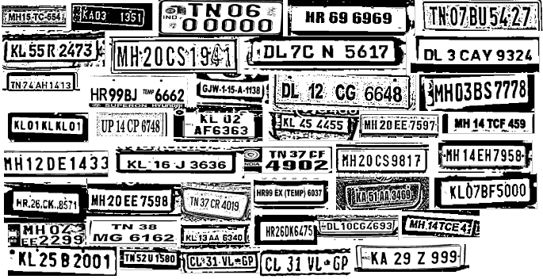

Here are few Examples of License Plate Recognition and Detection:

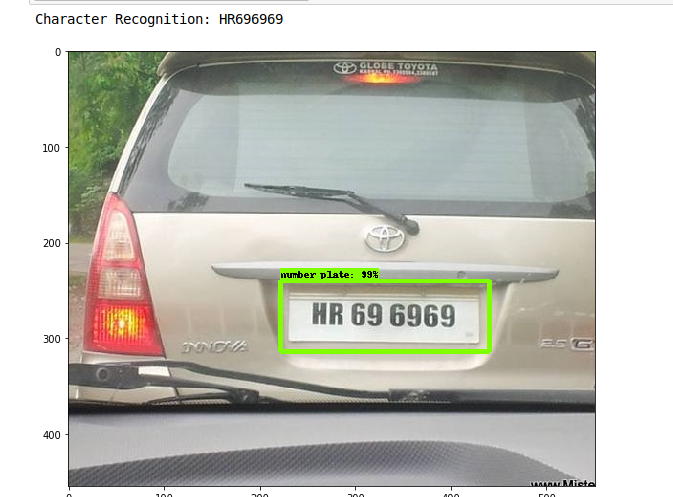

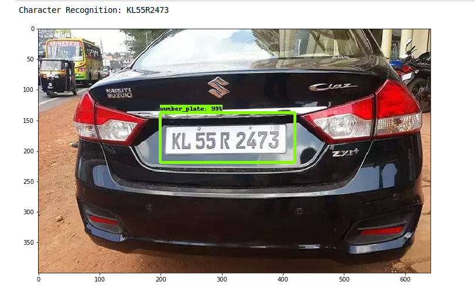

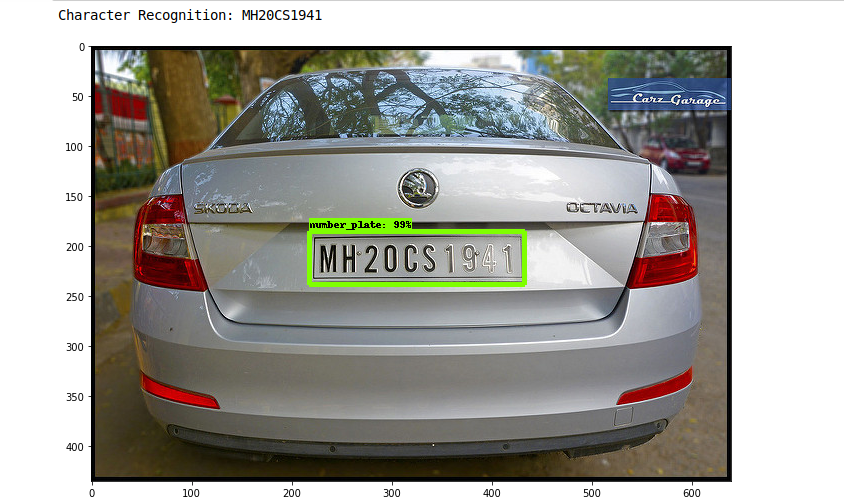

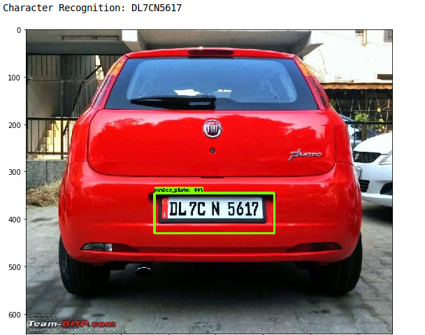

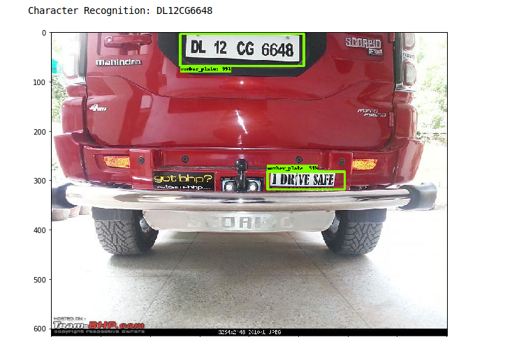

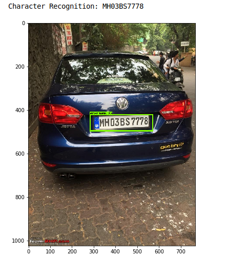

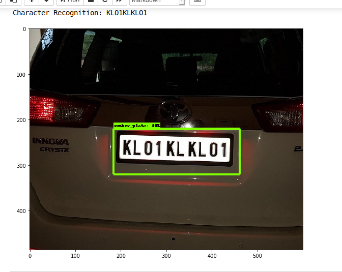

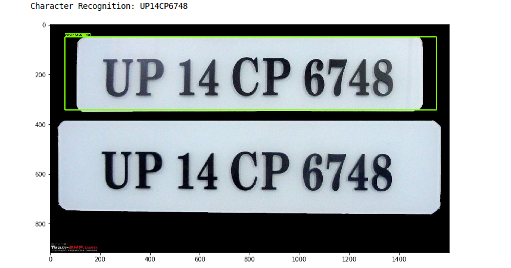

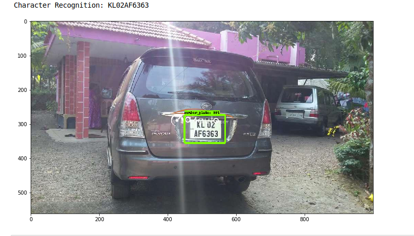

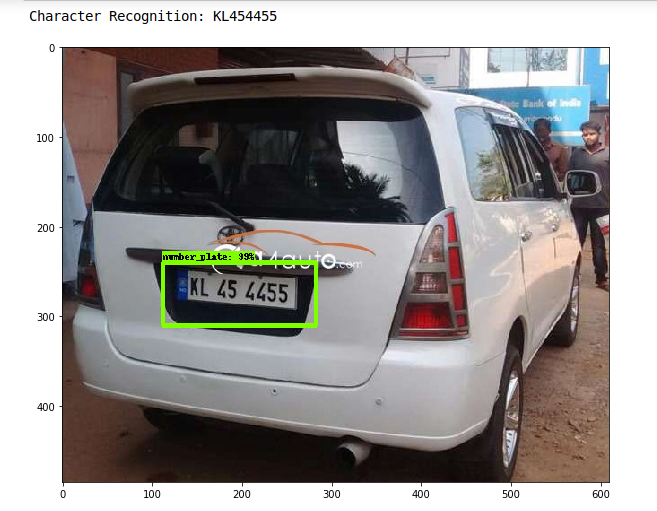

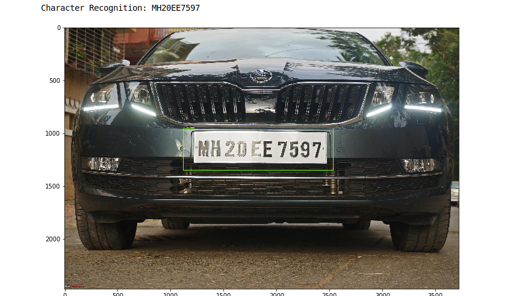

Loss Graph
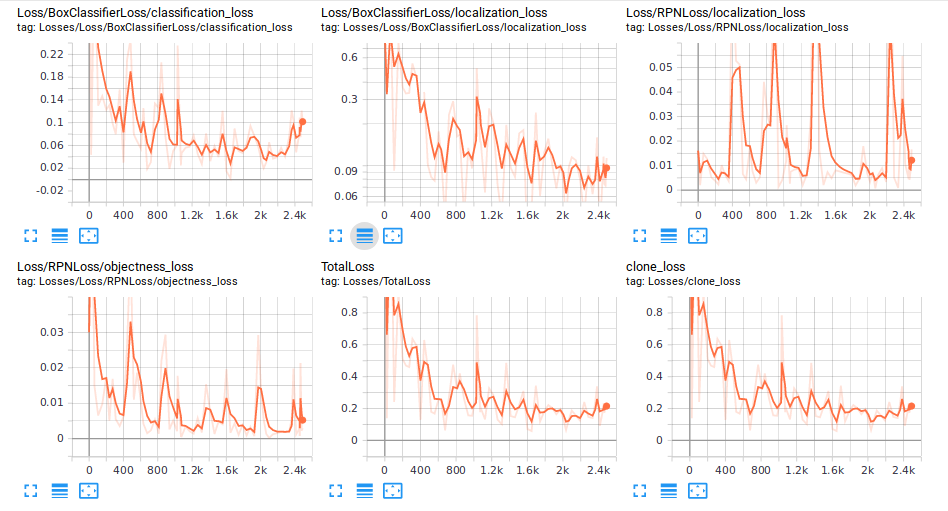
